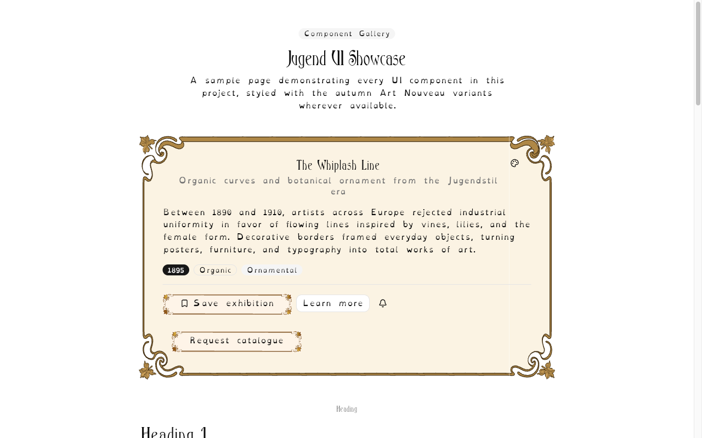

# jugend-ui

Art Nouveau / Jugendstil UI components. Free. Open Source.

[Live site](https://jugend-ui.vercel.app) · [Component showcase](https://jugend-ui.vercel.app/autumn)



## Features

- shadcn/ui-based, copy-paste components
- Season themes (Autumn live; Spring/Summer/Winter planned)
- Decorative SVG border-image frames

## Quick start

```bash
bun install && bun dev
```

## Install a component

```bash
bunx shadcn@latest add https://jugend-ui.vercel.app/r/button.json
```

## Fonts & assets

- **Ambrosia** ([Font Library](https://fontlibrary.org/en/font/ambrosia)) — OFL, bundled for `jugend` headings
- **Demo photos** — see [`assets/showcase/images/ATTRIBUTION.md`](assets/showcase/images/ATTRIBUTION.md) (Unsplash License)
- **SVG frames** — project-generated Art Nouveau frames, MIT-licensed with the code
- **Optional dev tooling** — `scripts/generate-svg.ts` uses `QUIVERAI_API_KEY` (see `.env.local.example`)

## Contributing

Please read [CONTRIBUTING.md](CONTRIBUTING.md).

## License

Licensed under the [MIT license](LICENSE).
